# Explorative Data Analysis Report

**Last update:** 20-08-2026  
**Author:** Muhammet Furkan Ünal

<br>

## 1 - Introduction

Rektum Cancer dataset involves MRIs which all gathered from Medipol Mega University Hospital. Machine model and imaging configurations varies imaging to imaging, also each patient has 2 types of imagings: ADC and T2, which we call ***modality***. Thats why a deep explorative analysis is mandatory. In this report, you will be finding from which perspectives data will be analyzed and results of each analyze. In addition, a conclusion -a general overview- on data and **preprocessing steps needs to be followed later on** will be provided.

### 1.1 - Dataset Size and Format

Dataset consists of varying number of batches and each batch followes a strict folder hierarchy as below:

```
batch-1/  
 ├── NONRESPONDER -OR- RESPONDER -OR- INTERMEDIATE/  
 |	 ├── [patient-name]/  
 |	 |	 ├── ADC/  
 |	 |	 |	 ├──imaging-file-name.nrrd  
 |	 |	 |	 └──segmentation-file-name.nrrd
 |	 |	 ├── T2/  
 |	 |	 |	 ├──imaging-file-name.nrrd  
 |   |   |   └──segmentation-file-name.nrrd

 ...
```

When all the data is counted and translated into a table; modality, label and number of each category distribution seems like below:

| Modality | Responder | Intermediate | Non-Responder | Total |
| --- | --- | --- | --- | --- |
| ADC | 52 | 44 | 92 | 188 |
| T2 | 52 | 44 | 92 | 188 |
| Total | 104 | 88 | 184 | 376 |

<br>

Total of size of 188 patients makes the dataset considerably a small sized dataset, a support might be necessary. Having 2 different modalities is an adventage, however, needs to be processeed carefully to utilize the data richness properly. Additionallyi data has a significant class-imbalance. So this makes:
+ using **class-weighted loss a considerable idea**,
+ using **statified train-test seperation a mandatory approach**. ***[!]***

### 1.2 - Manifest

To analyze the dataset from a single center, a *manifest.csv* is created using the script *manifest_builder.py*. The distribution in [[1.1]] is extracted with the help of *manifest.csv*.  

Manifest has following columns:
* `sample_id`
* `batch_id`
* `response_group`
* `patient_name`
* `patient_id`
* `modality`
* `patient_path`
* `modality_path`
* `nesting_depth`
* `image_path`
* `mask_path`
* `image_filename`
* `mask_filename`
* `nrrd_file_count`
* `other_file_count`
* `image_candidate_count`
* `mask_candidate_count`
* `image_dimension`
* `image_shape_x`
* `image_shape_y`
* `image_shape_z`
* `image_dtype`
* `image_encoding`
* `image_spacing_x_mm`
* `image_spacing_y_mm`
* `image_spacing_z_mm`
* `image_origin`
* `mask_dimension`
* `mask_shape_x`
* `mask_shape_y`
* `mask_shape_z`
* `mask_dtype`
* `mask_encoding`
* `mask_spacing_x_mm`
* `mask_spacing_y_mm`
* `mask_spacing_z_mm`
* `mask_origin`
* `shape_matches`
* `spacing_matches`
* `origin_matches`
* `is_valid_sample`
* `validation_errors`
* `manifest_created_at`

By using these metadatas, accessing the data is easier using the code and comparing spatial aspects such as *shape* and *origin* easier. Assessing the mask and imaging mismatches can be done easily and clearly.  

All thoughout the exploratory data analysis, *manifest.csv* is used as the only interface to access the data. **However, it's crucial to update the *manifest.csv* when anew batch arrives, otherwise, analyze would lose it's relevance and validity**.

### 1.3 - Next Steps

Each type of data needs to be analyzed -or processed- in it's own way. MRIs, for instance, are stack of slides of multiple 2D images, representing a 3D volume in real space. However, just like resampling images to one single dimension when feeding them to a CNN model, MRIs needs to be 'resampled' to a certain shape and spacing, in order to make sure all the imagings are representing the same volume in the real space. In order to find out all kinds of mismatches and fixing them, we need to apply following analyzes on the dataset:

1. ***Null and Duplicate Check.*** Must-do for all kinds of datasets, such anomalies harm the training and all kinds of statistics.  

2. ***Dimension Analyze (spacing, shape and origin).*** Resolution in 2D images are equivelent to **shape** in  MRIs. Spacing is unique to MRIs, represents **the real volume in millimeters of each voxel.** An imbalance in any of those needs to be fixed by **resampling and registering**, to prevent model memorize the shapes instead of patterns in the imaging.  

3. ***Volume Analyze.*** Tumors' real world volume equivelences needs to be analyzed before training in order to find out abnormal big tumors, **an inconsistency in the spacing-shape translation of the imaging**, such a sample would harm the training. Also **if volume is already clearly an indicate of the target label** (for example big tumors are labeled non-reponder and smaller tumors are labeled responder to treatment) deep learning might be overkill and a simple XGBoost model might work better.

4. ***Intensity (Brightness) Analyze.*** Intensity imbalance confuses the model and makes it more complicated to learn from it. T2 imagings are normalized using **z-score normalization**, as a result, each imaging has a similar intensity distribution, preventing model to memorize the difference in intensities instead of patterns. However, **ADC modality should not be normalized** because each voxel represents a quantitative value instead of relative signal image.

<br>

## 2 - Explorative Data Analysis

### 2.1 - Nulls, Duplicates and Mask-Image Mismatches

Among all 188 patients, **no null or duplicate imaging exists**.  
A little mismatch over 15 patients is resolved and updated before, recently each of 188 patients has 2 modalities and 1 image-mask pair for each modality.

However, one patient has mask-image shape mismatch:

````
GUL, ABDULLAH
````


Unfortunately, this is not fixable or normalizable etc. straight up broken data. **We can't use this in the training.** ***[1]***

### 2.2 - Dimension Analysis

Each MRI sample has 3 dimensions: **(width, height, depth)** (order might differ due to library differences). In the following graphs; x, y, z will be equivelent to width, height, depth respectively. Distribution of these will give us idea about how big the shape imbalance and how big the memory necessity is. In the table below, you can find the statictical distribution of each dimension for T2 and ADC seperately:

**T2:**
| Statistic | image_shape_x | image_shape_y | image_shape_z |
| --- | ---: | ---: | ---: |
| count | 188.000000 | 188.000000 | 188.000000 |
| mean | 445.521277 | 444.414894 | 31.218085 |
| std | 133.118276 | 134.208148 | 6.873984 |
| min | 256.000000 | 240.000000 | 15.000000 |
| 25% | 352.000000 | 352.000000 | 25.000000 |
| 50% | 400.000000 | 400.000000 | 30.000000 |
| 75% | 480.000000 | 480.000000 | 36.000000 |
| max | 768.000000 | 768.000000 | 65.000000 |  

<br>

**ADC:**
| Statistic | Image Shape X | Image Shape Y | Image Shape Z |
| --- | ---: | ---: | ---: |
| Count | 188.000000 | 188.000000 | 188.000000 |
| Mean | 191.723404 | 216.808511 | 34.122340 |
| Std | 55.140929 | 44.434721 | 7.385557 |
| Min | 96.000000 | 96.000000 | 15.000000 |
| P25 | 128.000000 | 188.000000 | 29.000000 |
| P50 | 224.000000 | 224.000000 | 35.000000 |
| P75 | 240.000000 | 256.000000 | 38.000000 |
| Max | 384.000000 | 328.000000 | 60.000000 |

<br>

In the figure below, you can find the graphical distribution of each dimension:

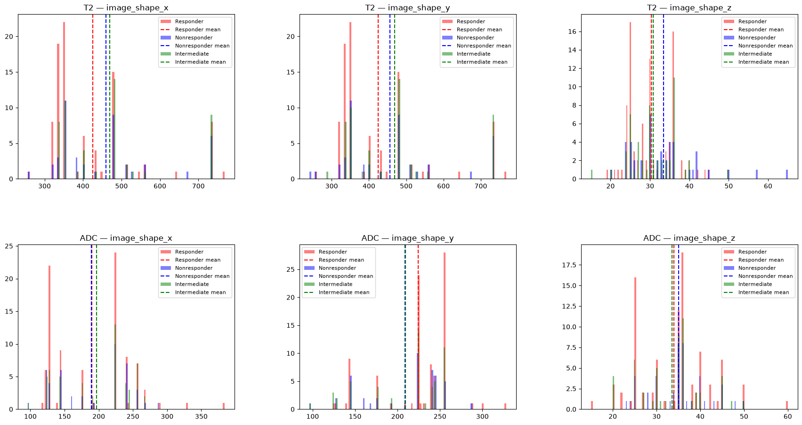

We can conclude 2 points from the analyze: 

1. Dimension distribution does not distinguish classes in either modalities. 
2. Shape difference is very large, resampling all images to the same dimension might cause loss of information on large images and generation of too much artifical data on small images. **Instead, we can crop the tumor are only**, this would minimize the huge dimension difference and prevent model to focus on unnecessary large areas on the image. After cropping, resampling will be done. ***[2]***

Other spatial information is ***spacings***, a similar table and graph is given below:


**T2:**
| Statistic | Image Spacing X (mm) | Image Spacing Y (mm) | Image Spacing Z (mm) |
| --- | ---: | ---: | ---: |
| Count | 188.000000 | 188.000000 | 188.000000 |
| Mean | 0.533377 | 0.533377 | 4.114692 |
| Std | 0.229270 | 0.229270 | 1.419615 |
| Min | 0.271739 | 0.271739 | 2.999975 |
| P25 | 0.357143 | 0.357143 | 3.000004 |
| P50 | 0.397727 | 0.397727 | 3.500000 |
| P75 | 0.625000 | 0.625000 | 4.125000 |
| Max | 1.171880 | 1.171880 | 9.227272 |

<br>

**ADC:**
| Statistic | Image Spacing X (mm) | Image Spacing Y (mm) | Image Spacing Z (mm) |
| --- | ---: | ---: | ---: |
| Count | 188.000000 | 188.000000 | 188.000000 |
| Mean | 1.332626 | 1.332626 | 4.566809 |
| Std | 0.415194 | 0.415194 | 1.551235 |
| Min | 0.781250 | 0.781250 | 2.999979 |
| P25 | 0.819672 | 0.819672 | 3.000000 |
| P50 | 1.388889 | 1.388889 | 3.600014 |
| P75 | 1.785714 | 1.785714 | 6.599999 |
| Max | 1.979167 | 1.979167 | 8.500000 |

<br>

In the graph below, you can find the distribution of each dimension's spacing:

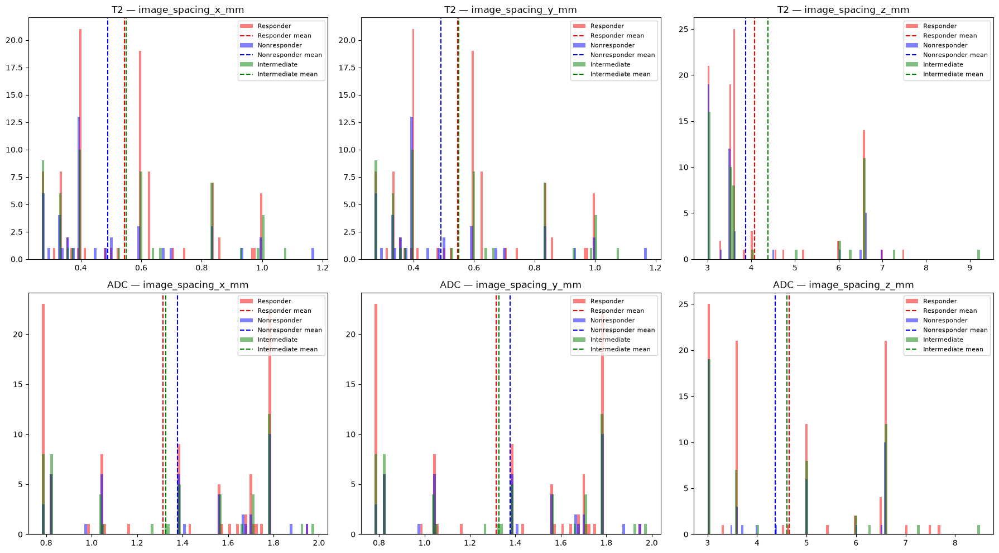

### 2.3 - Tumor Volume Analysis

If distinct classes are seperable on tumor volume, this would ease our work very much. In order to see this, we need to:

1. Count the number of tumor voxels in a mask,
2. Multiply the number of voxel by the $\mathrm{mm^3}$ volume of each voxel in corresponding image. As a result, we will get the volume of the tumor on that one image. Then, we can have the distribution graphs.

You can find the related graphs below:

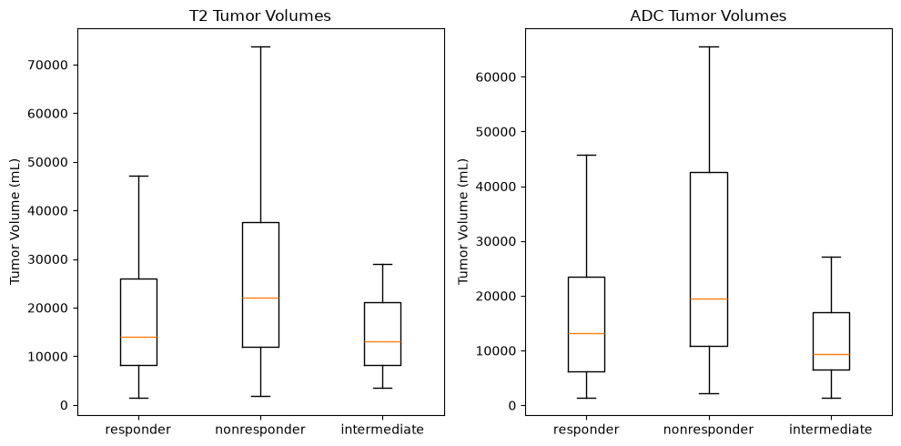

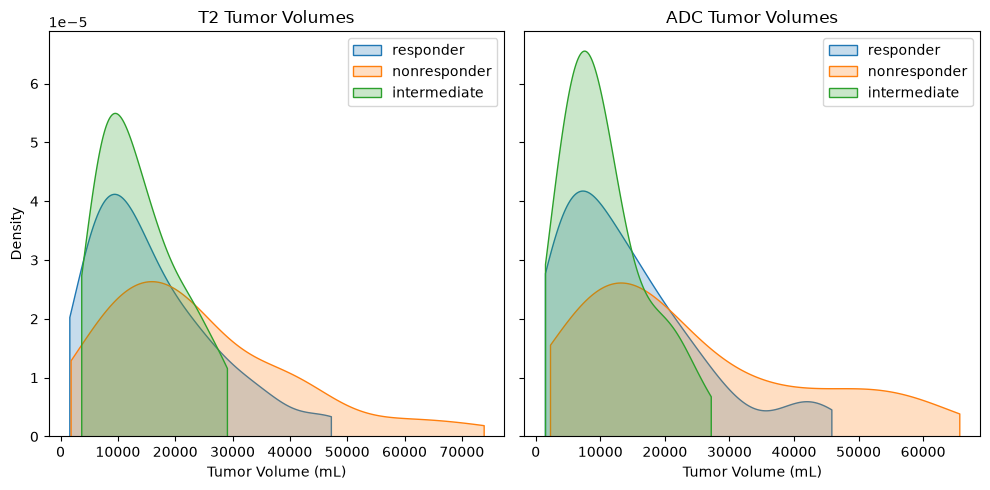

From the graphs, we can conclude that **tumor volumes does not seperate classes**, unfortunately. Each class have a similar distribution on volume but only number of samples belonging to each class differs.

### 2.4 - Intensity Analysis

Intensity imbalance confuses the model. Counting the intensity of all voxels on an imaging and then calculating the mean and percentiles will help us to realize does imbalance exist, or how large it is. Below, the tables shows the intensity of each voxels in each image (for example mean of mean intensity of all images):

**All Imaging Intensities**
| Statistic | Count | Mean | Std | P25 | P50 | P75 |
| --- | ---: | ---: | ---: | ---: | ---: | ---: |
| Count | 375.00 | 375.00 | 375.00 | 375.00 | 375.00 | 375.00 |
| Mean | 3,478,967.00 | 566.00 | 395.33 | 242.23 | 508.59 | 816.21 |
| Std | 4,177,432.00 | 361.75 | 249.54 | 202.85 | 340.19 | 481.52 |
| P25 | 771,651.50 | 276.78 | 189.24 | 78.00 | 245.00 | 438.00 |
| P50 | 2,287,071.00 | 553.24 | 397.95 | 213.00 | 465.00 | 813.00 |
| P75 | 4,088,560.00 | 833.59 | 575.18 | 358.00 | 743.50 | 1,171.58 |

<br>

But we will not use the whole imaging when training the model, what if we counted only tumor area voxels intensities? Table below shows the statistics for them:

**Only Tumor Area Intensities**
| Statistic | Count | Mean | Std | P25 | P50 | P75 |
| --- | ---: | ---: | ---: | ---: | ---: | ---: |
| Count | 375.00 | 375.00 | 375.00 | 375.00 | 375.00 | 375.00 |
| Mean | 19,115.23 | 624.70 | 136.13 | 528.70 | 612.75 | 707.98 |
| Std | 33,789.71 | 491.05 | 121.09 | 414.19 | 485.79 | 564.55 |
| P25 | 1,657.00 | 225.15 | 44.87 | 192.50 | 222.50 | 254.25 |
| P50 | 5,335.00 | 584.81 | 107.97 | 499.09 | 571.14 | 652.98 |
| P75 | 21,382.00 | 932.36 | 194.93 | 788.00 | 896.00 | 1,046.50 |

<br>

Since ADC and T2 modalities are translated differently, we need to analyze their intensities seperately. Let's handle T2 first. The graph below shows the distribution of intensities of all images on average and varying percentiles:

### 2.4.1 - T2 Intensity Analysis

**T2 Imagings Intensity Distribution**
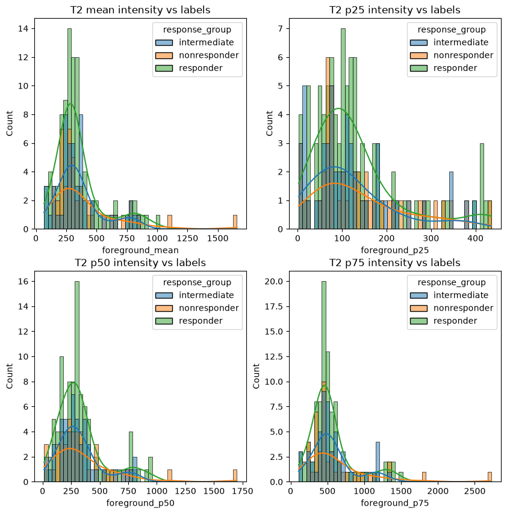

As can be seen, intensities are differing imaging to imaging a lot. Z-score normalization would fix the variation. Below you can see the same distribution after normalization:

**Normalized T2 Imagings Intensity Distribution**
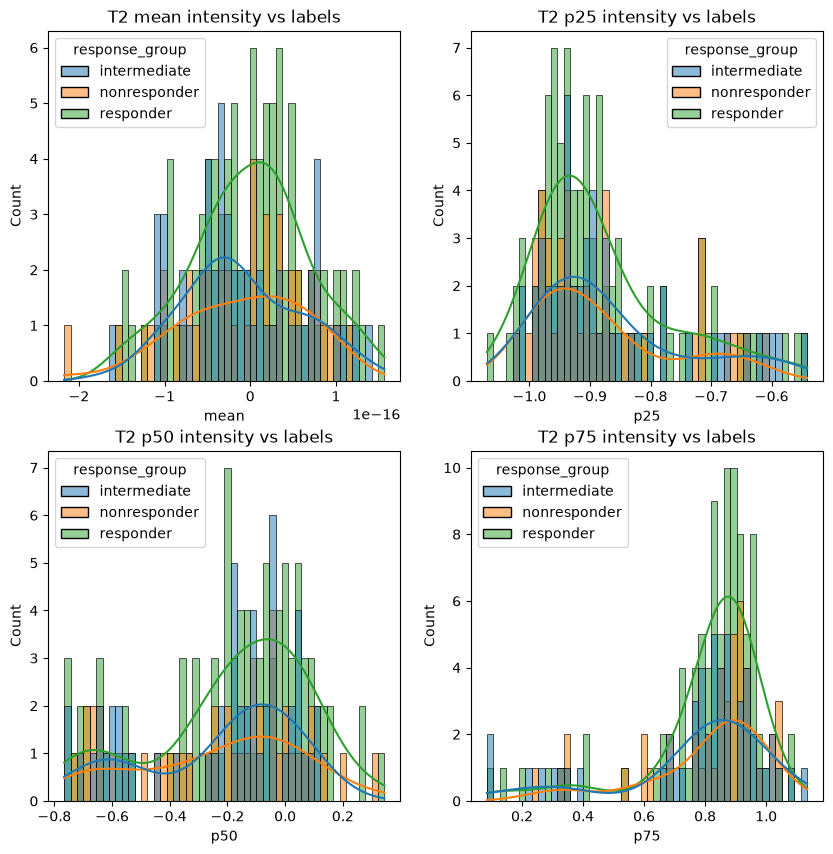

Clearly, differentiation is less, absolutely resulting better in training due to elimination of noise and equalizing the domains of voxel intensities.

Any type of normalization have to be applied carefully, causing the image to lose information or increasing the noise is not acceptable. In our case, the z-score normalization we applies is a standard one, equalizing **mean=0** and **std=1**. Below you can see the difference of normalized and raw imaging format:

**Original Imaging:**
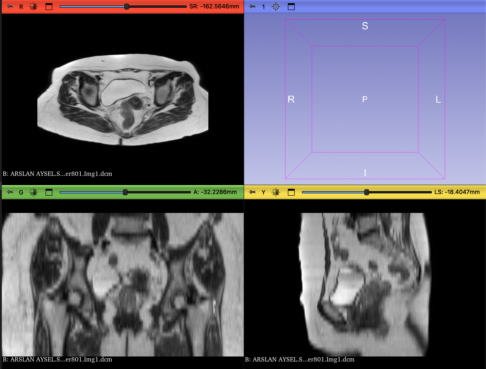

**Z-Score Normalized Imaging:**
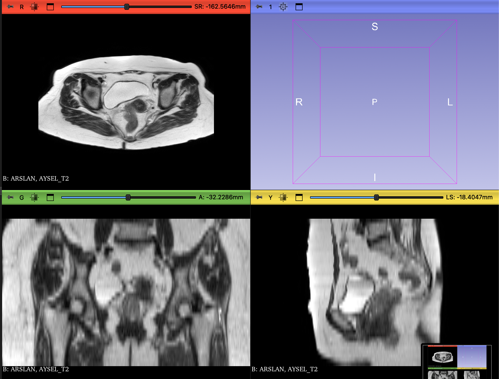

In our case however, we applied the normalization successfully and proved it does not harm the data, so it needs to be done in the way we proposed. ***[3]***

### 2.4.2 - ADC Intensity Analysis

As we said, intensity normalization should not be applied to ADC imagings. However, still analyzing the intensity might be useful to detect some broken imagings and strengthen the insights of us over the dataset. In the graphs below, you can see the distribution of all imagings' average intensities:

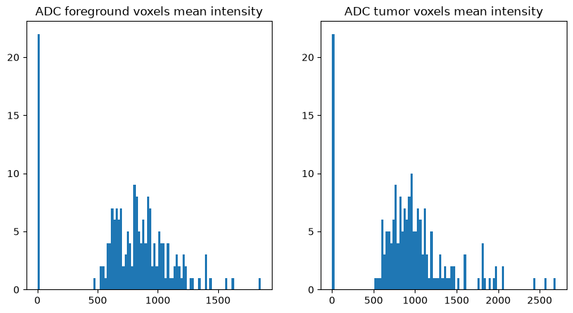

**Attention!** There are some critical outliers among the ADC imagings. Somewhere very close to 0, there exists more than 20 imagings, which might indicate a unit difference. Machines can outputs the ADC quantities in **$\mathrm{mm^2/s}$**, **$10^{-3}\ \mathrm{mm^2/s}$** or $10^{-6}\ \mathrm{mm^2/s}$. Unfortunately this information have not been given in the manifest, so have to figure it out ourselves.

First of all, let's figure out how many of these ***small-units*** samples exists:

| Batch ID | Large Units | Small Units | Total |
| --- | ---: | ---: | ---: |
| Batch 1 | 88 | 11 | 99 |
| Batch 2 | 77 | 11 | 88 |
| Total | 165 | 22 | 187 |

<br>

11 from each batch, shows us the cause is independent of batches. Now let's figure out the exact scale difference between large-units and small-units samples.  

Table below indicates the median value of small-units samples and large-units samples:

| Units | Tumor P50 |
| --- | ---: |
| Large Units | 919.000000 |
| Small Units | 0.931219 |

<br>

Now we have a very strong proof on 1000x rescaling might equalize the domains of different-units samples. Analyze each unit groups alone, and altogether with small-units rescaled 1000x:

**Only Small-Units:**
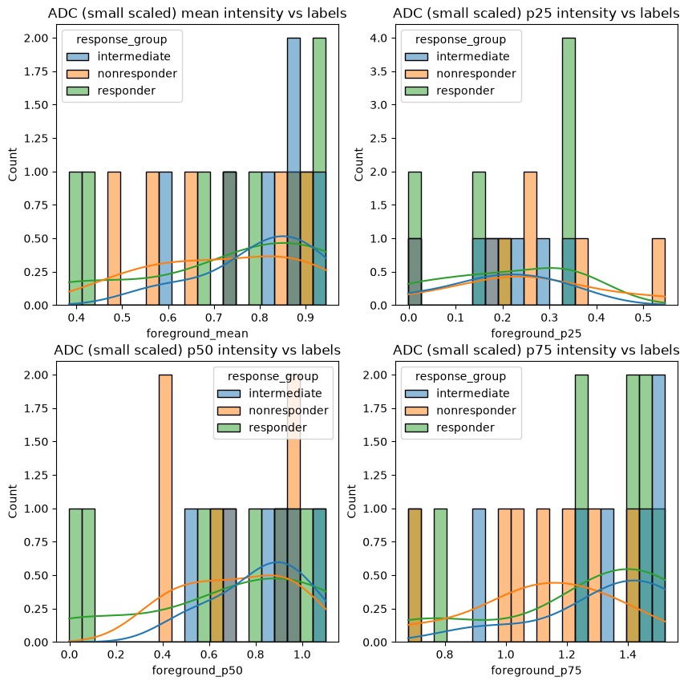

**Only Large-Units:**
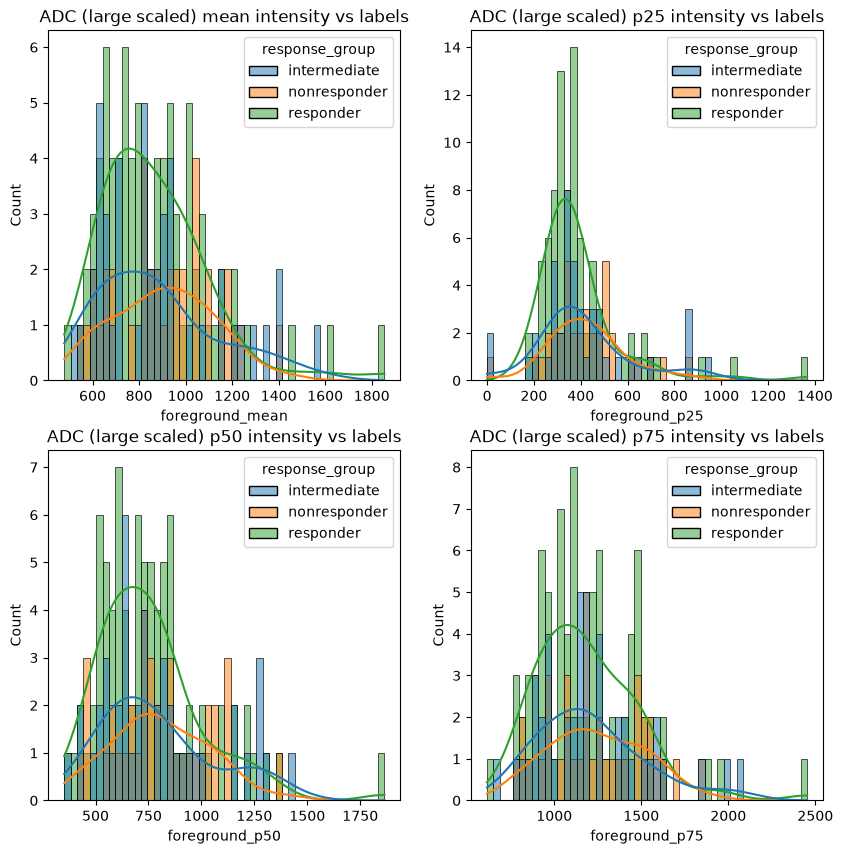

**Altogether with Small-units Rescaled 1000x:**
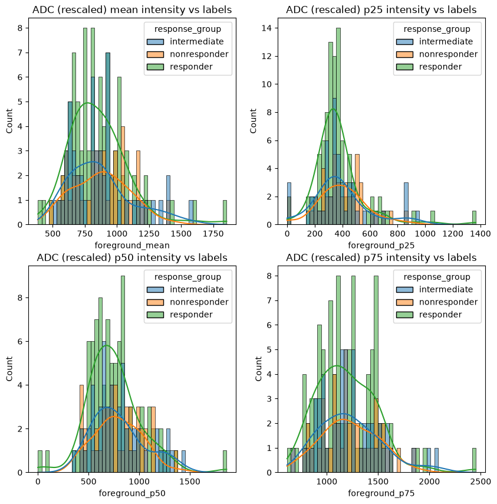

Last graph shows that still there exists some values near zero, made me curious. **An ADC imaging should not have any negative values voxels, but still being near zero might mean there exists some ADC imagings with negative voxels, decreasing the average to zero.**

### 2.4.3 - ADC Negative Intensity Analysis

This table below proves the existance of negative valued ADCs:

| Statistic | Count | Mean | Std | P25 | P50 | P75 |
| --- | ---: | ---: | ---: | ---: | ---: | ---: |
| Count | 187.00 | 187.00 | 187.00 | 187.00 | 187.00 | 187.00 |
| Mean | 910,686.70 | 774.02 | 541.55 | 355.54 | 686.10 | 1,062.18 |
| Std | 480,997.00 | 358.08 | 246.80 | 215.89 | 342.54 | 475.87 |
| Min | 175,979.00 | 0.38 | 0.34 | -1.00 | -0.00 | 0.68 |
| P25 | 633,145.00 | 644.08 | 432.97 | 273.50 | 543.00 | 917.00 |
| P50 | 771,392.00 | 814.76 | 564.61 | 340.00 | 701.00 | 1,120.00 |
| P75 | 1,035,282.00 | 973.36 | 690.35 | 443.50 | 854.00 | 1,356.50 |

<br>

What made me miss the existance of negative values was not to check minimum intensities in each sample. Existance of negative values in ADC is not acceptable, we need to question this further. When I query negative value containing ADC imagings **25 sample pops up:**

1. CELIK, OSMAN
2. KOZIK, TUNCAY
3. MERDIM, BURHAN
4. TASIMOVA, GULBARSHIN
5. TUZ, GULSEN
6. ANDELKOVIC, GORAN
7. OZYURT, ASIYE
8. RACHEV, NIKOLAY
9. SIS, CEMAL
10. AKBAS, EMINE MELEK
11. GOK, KADRIYE
12. SAFAROVA, ILAHA
13. BUTUN, ASUR
14. RASHIDOV, BAKHITZHAN
15. YETIMLER, REMZIYE
16. CALISKAN OZALP, BAHAR
17. OBI, NDIBE JOSEPHAT
18. ALIYEV, HASAN
19. AYATA, EMINE
20. BIGIRA, JOHN BOSCO
21. CIFTCI, LEVENT
22. ERGUNE, TELAT
23. KOCYIGIT, GULFIDAN
24. ORKUN, AYSEL
25. TEZEL, OMER

After checking randomly, I realized **negative values are backgrounds.** However, we need to prove this by checking **the weight of the negative voxels**, they have to be small numbers enough to not to change any information in the imaging, when we zero them straight:

| No | Patient Name | All Mean | Neg Mean |
| ---: | --- | ---: | ---: |
| 1 | CELIK, OSMAN | 0.8622 | -0.0229 |
| 2 | KOZIK, TUNCAY | 668.8952 | -1.0000 |
| 3 | MERDIM, BURHAN | 0.9406 | -0.0396 |
| 4 | TASIMOVA, GULBARSHIN | 0.7454 | -0.0352 |
| 5 | TUZ, GULSEN | 0.5869 | -0.1223 |
| 6 | ANDELKOVIC, GORAN | 618.0167 | -1.0000 |
| 7 | OZYURT, ASIYE | 0.7225 | -0.1749 |
| 8 | RACHEV, NIKOLAY | 0.8636 | -0.0311 |
| 9 | SIS, CEMAL | 0.8568 | -0.1392 |
| 10 | AKBAS, EMINE MELEK | 271.6863 | -256.0000 |
| 11 | GOK, KADRIYE | 0.4269 | -0.0699 |
| 12 | SAFAROVA, ILAHA | 0.6851 | -0.1342 |
| 13 | BUTUN, ASUR | 604.7395 | -1.0000 |
| 14 | RASHIDOV, BAKHITZHAN | 0.8232 | -0.0873 |
| 15 | YETIMLER, REMZIYE | 0.8658 | -0.0109 |
| 16 | CALISKAN OZALP, BAHAR | 0.5775 | -0.0102 |
| 17 | OBI, NDIBE JOSEPHAT | 0.6379 | -0.0343 |
| 18 | ALIYEV, HASAN | 0.8021 | -0.0490 |
| 19 | AYATA, EMINE | 0.3839 | -0.0625 |
| 20 | BIGIRA, JOHN BOSCO | 0.9102 | -0.0498 |
| 21 | CIFTCI, LEVENT | 0.9446 | -0.0432 |
| 22 | ERGUNE, TELAT | 270.0076 | -256.0000 |
| 23 | KOCYIGIT, GULFIDAN | 0.8754 | -0.0654 |
| 24 | ORKUN, AYSEL | 0.7288 | -0.0862 |
| 25 | TEZEL, OMER | 0.9212 | -0.0500 |

<br>

**Caution:** Two imagins has **incredibly high negative means**, -256. Fortunately, I checked them manually on 3d Slicer and they are just background. Can be zeroed safely.

My conclusion from here is, just **zero the negatives straight**.

The altogether distribution after zeroing all negatives:

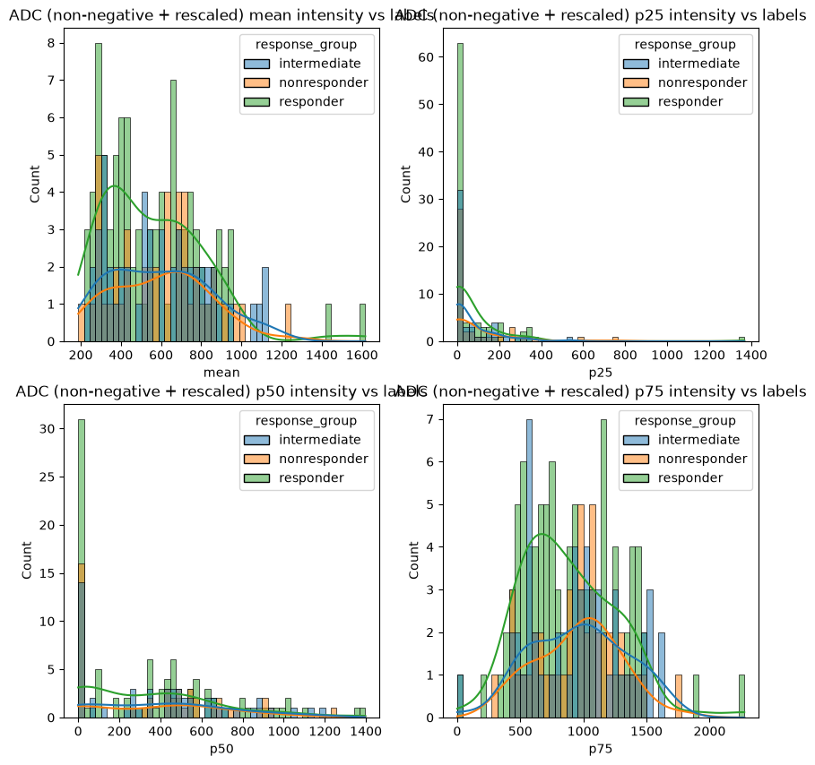

From mean graph, we can see all imagings are distributed naturally. In other graphs many zeros might seem dangerous but they are not, because they are percentiles and thanks to how big the background is, all most of the imagins have large zero areas all over their surfaces. **After random manual check on 3D Slicer, I approve the images are fine.**  

Comparison of an image before/after manipulation:

**Before (Raw):**


**After (Zero Negatives and Rescaled):**
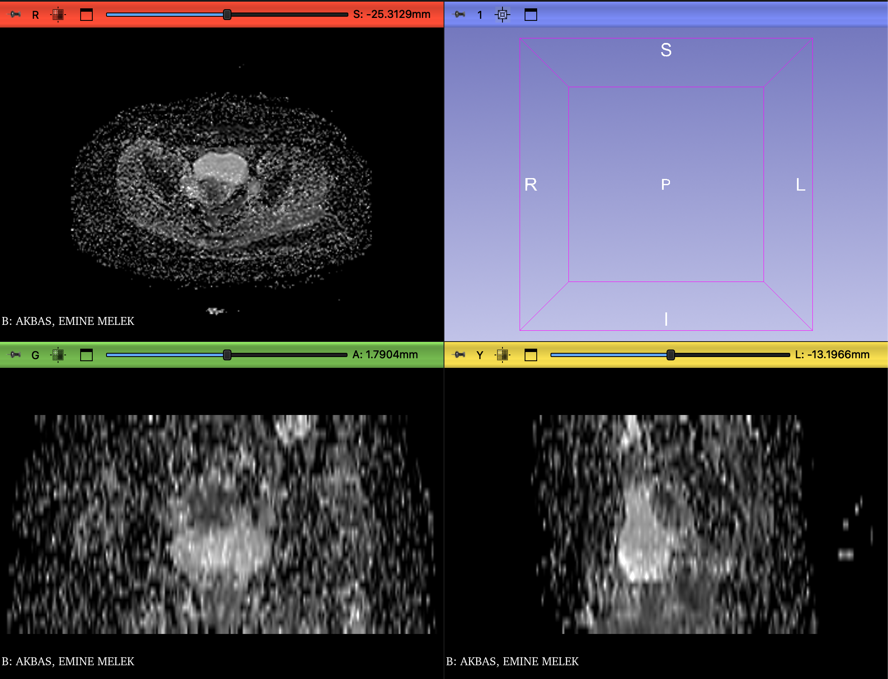

So zeroing negative values and rescaling small-unit ADC imagings can safely be applied to the data. ***[4]***  

<br>

## 3 - Roadmap to Preprocessing

After all the analysis, we will be applying all the manipulations [1], [2], [3] and [4]:

1. Eliminate patient GUL, ABDULLAH.
2. Crop the tumor are and resample the shape and spacings.
3. Apply z-score intensity normalization on T2 imagings.
4. Zero negative values and rescale x1000 small-unit ADC imagings.

Then, dataset should be ready to training. However, training process might give us idea about the relevance of the preprocessing.  

Additionally, this one is not for preprocessing but, **don't forget the *[!]*, *use class weighted loss and statified train-test seperation when training.***

<br>

## 4 - Conclusion

When all the dataset is carefully analyzed, it's clear that the dataset is **far from being a clear dataset**, in order to achieve a good performance with the trained model, not only training process should be applied incredibly carefully, but also exploratory data analysis and preprocessing has to be applied overly cautious. Otherwise, data might lose information, or domain difference between samples on intensity, spatial aspects or any other aspects, training won't be proper and bad results will be unavoidable. **However, even all the exploratory data analysis, preprocessing and training done perfectly, still any meaningful results might not be achieved**, because **(1)** dataset has incredible imbalances and domain difference in many aspects in it's raw form and **(2)** number of samples might not be enough for a Q1 study. Nevertheless, we should try our bests. Still all the work done so far and in the future might be an infrastructure even not any satisfying results achieved, but we might be able to find better and more samples and refine the work.  

Stay sharp and smart!